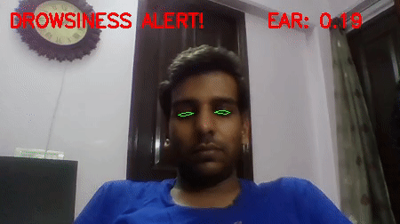

# OPENCV DROWSINESS DETECTION
### Detects and Alerts if the driver is starting to doze off.

Very simple and effective blink detector using just Python, OpenCV and dlib.

All thanks to Adrian Rosebrock (from [pyimagesearch](https://www.pyimagesearch.com/)) for making
great tutorials. This project is inspired from his blog: [Drowsiness detection with OpenCV](https://www.pyimagesearch.com/2017/05/08/drowsiness-detection-opencv/).
I have included the author's code and the one I wrote my self as well.

### Download shape predictor
Download link <a href="https://drive.google.com/file/d/1vEUeFoQ-ZQ-GbvXi8_Id2AM4W_MdaLYv/view?usp=sharing">File</a>

### DLIB Instalation
Visual Studio

Use Microsoft Visual Studio for compiling. Download at https://visualstudio.microsoft.com/visual-cpp-build-tools/ Make sure the Cmake option is selected, the default option is not changed, in our case, the required options are MSVC Vxxx, Windows 10 SDK xxxx, C++ CMake for Windows .

## **Key Points**
1. Steps involved:
    1. Localize the face in the video frame
    2. Detect the key facial structures on the face ROI
    3. Extract out the eyes landmarks.
    4. Calculate EAR (eye aspect ratio)
    5. Threshold the EAR to determine if it is below certain threshold and increment the counter.
    6. If the person's EAR is below threshold for more than certain number of frames, alert the driver
    by playing the sound.
2. Assumptions:
    1. We already have the trained face detector and face landmark detector.
    2. There is only one face in the frame
3. **EAR** (Eye Aspect Ratio) formula is as follows:


4. The eye aspect ratio will be large and remain approximately constant when the eyes are open.
 It will rapidly approach zero when the driver closes his/her eyes. If it remains low for long enough time
 we can say that the driver has closed his/her eyes. 
5. The dlib's face detector is an implementation of **One Millisecond Face Alignment with an Ensemble of Regression Trees** paper by Kazemi and Sullivan (2014).
6. 68 coordinates are detected for the given face by the face detector as shown below:

7. dlib's framework can be trained to predict any shape. Hence it can be used for custom shape detections as well.
8. Used dlib's pre-trained face detector based on the modification of the standard **Histogram of Oriented Gradients + Linear SVM method** for object detection.
9. Used opencv's convexHull function to determine the contour for the detected eye landmarks
10. This method uses just the eye aspect ratio as the metric to determine if the driver's eyes are closed or open.
11. We use **playsound** library to play sound in python. We also use seperate thread for playing sound
so that our main thread doesn't block and our script keeps on working and the sound will play in the background.
12. Two important techniques used in this project:
    1. Facial Landmark Detection
    2. Eye Aspect Ratio

 ## **Requirements: (with versions I tested on)**
 1. python          (3.7.3)
 2. opencv          (4.1.0)
 3. numpy           (1.61.4)
 4. imutils         (0.5.2)
 5. dlib            (19.17.0)

 ## **Commands to run the detection:**
 ```
 python detect_drowsiness.py \
	--shape-predictor shape_predictor_68_face_landmarks.dat \
	--alarm alarm.wav
```

## **Results:**
The results are pretty accurate. We can see that it accurately and reliably detects if the driver
starts to fall asleep. It works pretty well in real time and doesn't need very superior hardware.




## **Limitations**
None
